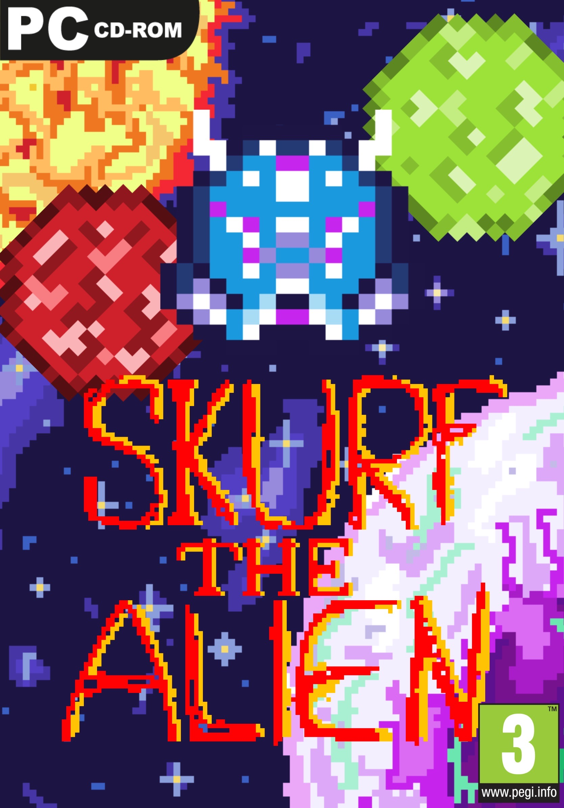

# Workshop Game from scratch 2020

Code produced by students for the "back-to-school" workshop - first year in Game Design @lecolededesign.

To play those games you will need to download [processing](https://processing.org/) and install :
- the sound library
- the minimim library

You can then download or clone this[github](https://github.com/AtelierNum/workshop_gamefromscratch_2020) repo and launch each game within the processing IDE.

Instructions available to students can be found [here](https://github.com/b2renger/processing_physics_game_workshop) (in french).

Cette page regroupe les projets réalisé par les étudiants en Game Design @lecolededesign dans le cadre d'un workshop d'initiation au code

Pour jouer vous aurez besoin de télécharger [processing](https://processing.org/) et d'installer deux bibliothèques :
-  sound 
-  minimim 

Vous pourrez ensuite télécharger l'ensemble des projets depuis ce dépot [github](https://github.com/AtelierNum/workshop_gamefromscratch_2020) et lancer chaque jeu.

Les instruction données aux étudiants sont aussi disponibles ici [here](https://github.com/b2renger/processing_physics_game_workshop) 

## Amélie Conoir 
 
 

## Morgane Agoulon
 
 

## Loris Cousin
 
 

## Ilian Goudet-Ouardane
 
 

## Jules Michel
 
 

## Loïc Nozet
 
 

## Noé Pinatel
 
 

## Ilias El Forkani
 
 

## Paul Gourmand
 
 